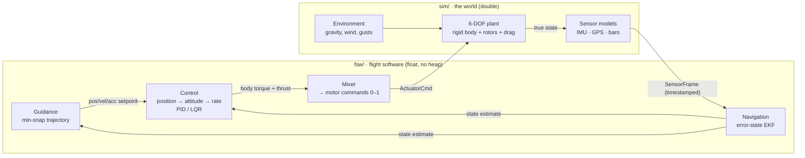
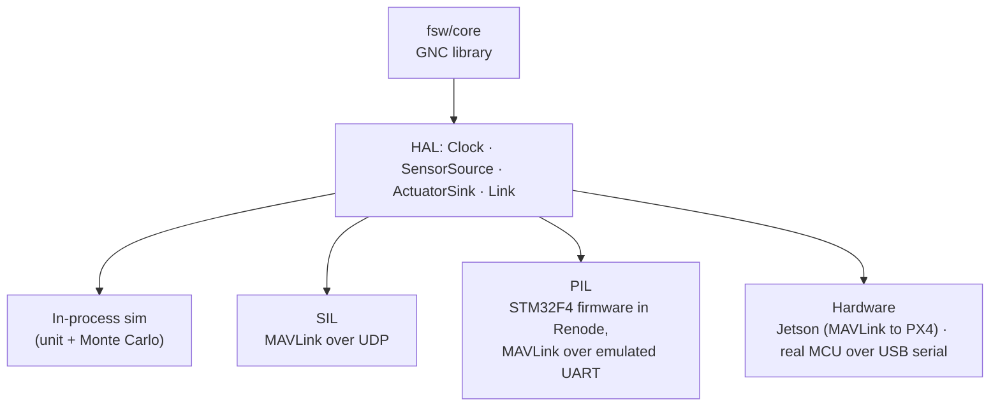

# Architecture

Two halves that never include each other:

- **`fsw/`** is the flight software: the code that would fly. Float, no heap, no exceptions,
  fixed-rate, deterministic.
- **`sim/`** is the world: 6-DOF dynamics, sensor models and wind, in double precision.

They only meet through plain message structs: in-process first, later over MAVLink.

## Guidance, navigation and control loop

## One flight-software core, four environments

The same `fsw/core` library runs everywhere. Only the transport under the HAL changes.

Milestones and the full plan: see the roadmap in the [README](../README.md).
